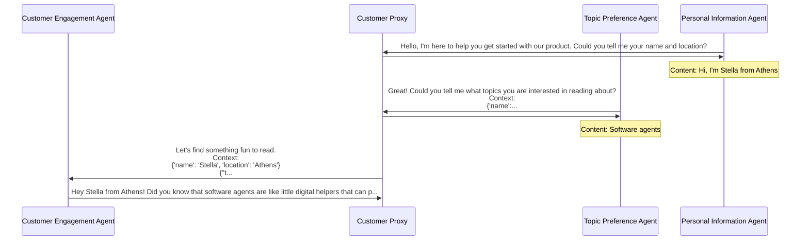

# Waldiez

[](https://badge.fury.io/py/waldiez)

## Make AI Agents Collaborate: Drag, Drop, and Orchestrate with Waldiez




## Installation

On PyPI:

```bash
# highly recommended to use a virtual environment:
python3 -m venv .venv
#
## on linux/macOS, you can use:
#
#. .venv/bin/activate
#
## on windows, you can use sth like:
#
# .venv\Scripts\activate
# .venv\Scripts\activate.bat
# .venv\Scripts\activate.ps1
#
# you might also want to upgrade pip:
python3 -m pip install --upgrade pip
# and install waldiez:
python3 -m pip install waldiez
```

Additionally, you can install the optional dependencies for JupyterLab and Waldiez Studio:

```bash
pip install waldiez[studio]  # or pip install waldiez_studio
pip install waldiez[jupyter]  # or pip install waldiez_jupyter
# or both
pip install waldiez[studio,jupyter]
```

## Usage

There are several ways to use Waldiez:

- Use the **Playground** to create flows in your browser
- Launch one for the available container images via **Docker or Podman**
- Work with **JupyterLab**, **VS Code**, or **Waldiez Studio** for both creating and running flows locally
- Use the **Python API** to integrate with your own code
- Run it from the **CLI**

### UI Options

- For creating-only (no exporting or running) waldiez flows, you can use the playground at <https://waldiez.github.io>.
The repo for the js library is [here](https://github.com/waldiez/react).
- There is also a jupyterlab extension [here](https://github.com/waldiez/jupyter)
- You also can use the vscode extension:
  - [repo](https://github.com/waldiez/vscode)
  - [marketplace](https://marketplace.visualstudio.com/items?itemName=Waldiez.waldiez-vscode)
- Finally, you can use [waldiez-studio](https://github.com/waldiez/studio), which includes a FastAPI app to handle the conversion and running of waldiez flows.

#### Using the Jupyter Extension

If you installed waldiez with the jupyter extra, you can use the jupyter extension to create and run waldiez flows.

```shell
waldiez lab
```

Alternatively, you can start jupyterlab as usual, the waldiez extension should be loaded automatically. If not, make sure the `jupyter` command is the one that is installed in the same environment as waldiez.

```shell
jupyter lab
```

#### Using Waldiez Studio

If you installed waldiez with the studio extra, you can launch the bundled FastAPI app that will allow you to create and run waldiez flows.

To see the available options, you can run:

```shell
waldiez studio --help

# example output (from typer):

# Usage: waldiez studio [OPTIONS]

# --host                TEXT        The host to run the server on [default: localhost]
# --port                INTEGER     The port to run the server on [default: 8000]
# --reload --no-reload              Reload the server on file changes [default: no-reload]
# --log-level
#                      [CRITICAL|ERROR|WARNING|INFO|DEBUG]  The log level [default: INFO]
# --domain-name         TEXT        [default: localhost]
# --trusted-hosts       TEXT        [default: []]
# --trusted-origins     TEXT        [default: []]]
# --force-ssl --no-force-ssl        Force SSL [default: no-force-ssl]
# --version                         Show the version
# --help -h                         Show this message and exit.
```

### Using Docker/Podman 🐳

We provide three ways to use the Waldiez using docker/podman:

- Using the jupyter extension (image: `waldiez/jupyter`) (this starts a jupyterlab server)
- Using just the core python package to convert and run waldiez flows (image: `waldiez/waldiez`)
- Using waldiez-studio (image: `waldiez/studio`) (this starts a FastAPI server)

#### sing Docker/Podman on Linux/macOS/Windows with WSL

On Linux/MacOS/Windows with WSL, you can use the following commands to run the images:

```shell
CONTAINER_COMMAND=docker # or podman

# Pull the image
$CONTAINER_COMMAND pull waldiez/waldiez

# Convert a Waldiez flow to a python script or a jupyter notebook
$CONTAINER_COMMAND run \
  --rm \
  -v /path/to/a/flow.waldiez:/flow.waldiez \
  -v /path/to/an/output:/output \
  waldiez/waldiez convert --file /flow.waldiez --output /output/flow.py
  # this will generate a python script. To generate a jupyter notebook,
  # we can just change te file extension:
  # --output /output/flow.ipynb
  # to force generation if the output exists:
  # --force

# with selinux and/or podman, you might get permission (or file not found) errors, so you can try:
$CONTAINER_COMMAND run \
  --rm \
  -v /path/to/a/flow.waldiez:/flow.waldiez \
  -v /path/to/an/output:/output \
  --userns=keep-id \
  --security-opt label=disable \
  waldiez/waldiez convert --file /flow.waldiez --output /output/flow[.py|.ipynb] [--force]

# To convert a Waldiez flow to a python script or a jupyter notebook and run it:
$CONTAINER_COMMAND run \
  --rm -ty \
  -v /path/to/a/flow.waldiez:/flow.waldiez \
  -v /path/to/an/output:/output \
  waldiez/waldiez run --file /flow.waldiez --output /output/output[.py]
```

#### Using Docker/Podman on Windows (PowerShell or CMD) 🪟

You can run Waldiez in a container on Windows using **Docker Desktop** (or Podman with WSL2). There are two ways to run the commands depending on your shell:

- **PowerShell or CMD**
- **Git Bash** (if installed)

> ⚠️ **Note:** Make sure your files are located in a **shared directory** that Docker Desktop has access to (e.g., `C:\Users\YourName\...`). See [Docker Desktop file sharing guide](https://docs.docker.com/desktop/settings/windows/#file-sharing) if needed.

##### 🔷 PowerShell Example

```powershell
# Define the container command
$CONTAINER_COMMAND = "docker"  # or "podman"

# Pull the image
& $CONTAINER_COMMAND pull waldiez/waldiez

# Define full Windows paths
$flow = "C:\Users\YourName\Documents\flow.waldiez"
$output = "C:\Users\YourName\Documents\waldiez_output"

# Convert the flow to a Python script
& $CONTAINER_COMMAND run --rm `
  -v "$flow:/flow.waldiez" `
  -v "$output:/output" `
  waldiez/waldiez convert --file /flow.waldiez --output /output/flow.py

# Or run the flow directly
& $CONTAINER_COMMAND run --rm `
  -v "$flow:/flow.waldiez" `
  -v "$output:/output" `
  waldiez/waldiez run --file /flow.waldiez --output /output/output.py
```

##### 🔶 Git Bash Example

If you're using Git Bash or WSL, convert the Windows paths to Unix-style:

```shell
CONTAINER_COMMAND=docker  # or podman
FLOW_PATH=/c/Users/YourName/Documents/flow.waldiez
OUTPUT_PATH=/c/Users/YourName/Documents/waldiez_output

$CONTAINER_COMMAND run --rm \
  -v "$FLOW_PATH:/flow.waldiez" \
  -v "$OUTPUT_PATH:/output" \
  waldiez/waldiez convert --file /flow.waldiez --output /output/flow.py

$CONTAINER_COMMAND run --rm \
  -v "$FLOW_PATH:/flow.waldiez" \
  -v "$OUTPUT_PATH:/output" \
  waldiez/waldiez run --file /flow.waldiez --output /output/output.py
```

#### ✅ Tips

- Try to always use **absolute paths** for `-v` mounts.
- Avoid special characters or spaces in paths.
- If you see `file not found` errors, double-check path formats and file sharing settings.

### Using the Python API

#### Export a flow

You can convert a `.waldiez` flow to a python script or a jupyter notebook with the generated ag2 agents and chats

```python
# Export a Waldiez flow to a python script or a jupyter notebook
from waldiez import WaldiezExporter
flow_path = "/path/to/a/flow.waldiez"
output_path = "/path/to/an/output.py"  # or .ipynb
exporter = WaldiezExporter.load(flow_path)
exporter.export(output_path)
```

#### Run a flow

```python
# Run a flow
from waldiez import WaldiezRunner
flow_path = "/path/to/a/flow.waldiez"
output_path = "/path/to/an/output.py"
runner = WaldiezRunner.load(flow_path)
runner.run(output_path=output_path)
```

### Using the Command Line

```shell
# Convert a Waldiez flow to a python script or a jupyter notebook
waldiez convert --file /path/to/a/flow.waldiez --output /path/to/an/output/flow[.py|.ipynb]
# Convert and run the script, optionally force generation if the output file already exists
waldiez run --file /path/to/a/flow.waldiez --output /path/to/an/output/flow[.py] [--force]
```

Repos (submodules) included in this repo:

- [packages/core/python](https://github.com/waldiez/python) is the core python package to convert and run waldiez flows.
- [packages/core/react](https://github.com/waldiez/react) is the core react package to create and visualize waldiez flows.
- [packages/jupyter](https://github.com/waldiez/jupyter) is a jupyter extension that combines the core python and react packages.
- [packages/vscode](https://github.com/waldiez/vscode) is a vscode extension that combines the core python and react packages.
- [packages/studio](https://github.com/waldiez/studio) is a web app that combines the core python and react packages.
- [examples](https://github.com/waldiez/examples) is a collection of exported waldiez flows.
- [docs](https://github.com/waldiez/docs) has the documentation for the usage of waldiez.
- [package_templates](https://github.com/waldiez/package_templates) is a collection of templates for the projects in this repo.

## License

This project is licensed under the [Apache License, Version 2.0 (Apache-2.0)](https://github.com/waldiez/waldiez/blob/main/LICENSE).

## Contributors ✨

Thanks goes to these wonderful people ([emoji key](https://allcontributors.org/docs/en/emoji-key)):

<!-- ALL-CONTRIBUTORS-LIST:START - Do not remove or modify this section -->
<!-- prettier-ignore-start -->
<!-- markdownlint-disable -->
<!-- markdownlint-restore -->
<!-- prettier-ignore-end -->
<!-- ALL-CONTRIBUTORS-LIST:END -->

This project follows the [all-contributors](https://github.com/all-contributors/all-contributors) specification. Contributions of any kind welcome!
