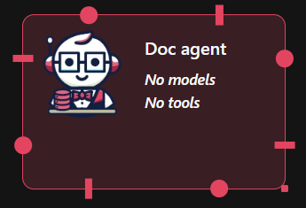
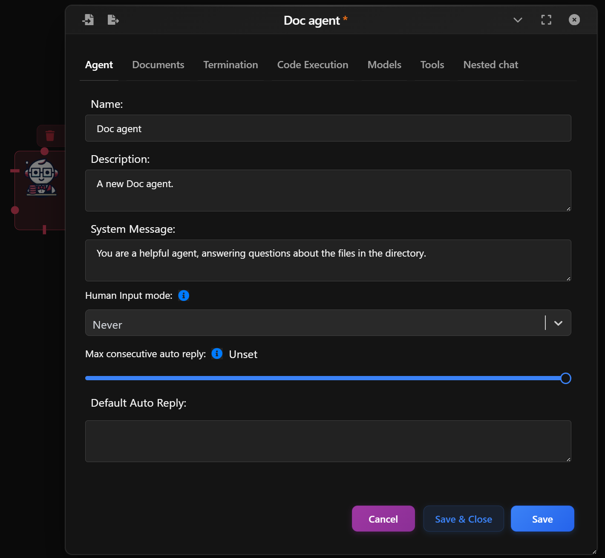
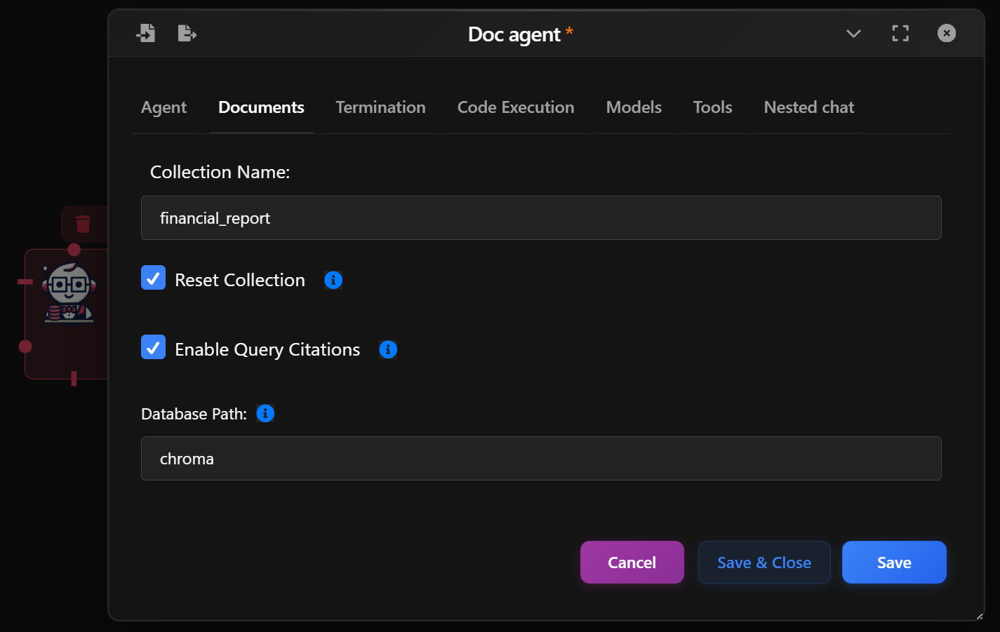
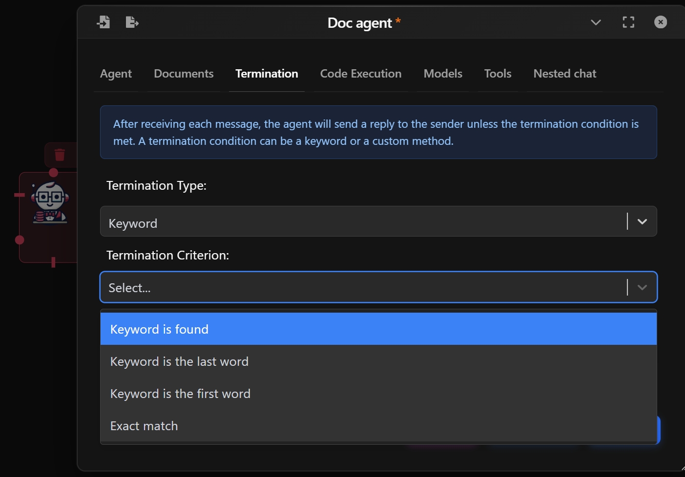
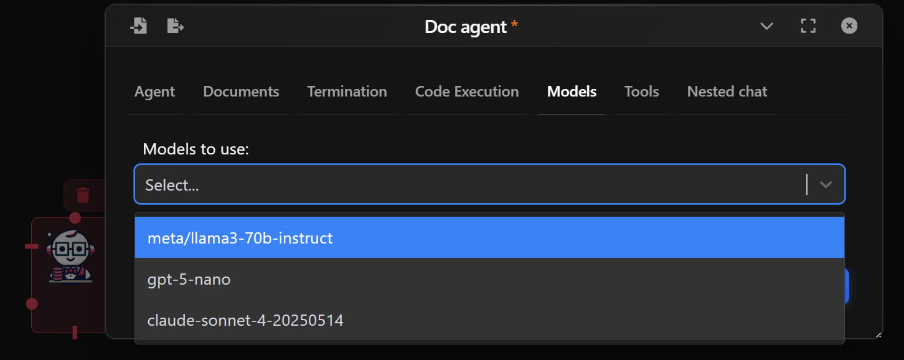

The *Docs Agent* leverages RAG (Retrieval-Augmented Generation) to enhance your assistant by letting it fetch and reference documents before responding. It combines language model reasoning with contextual data retrieval, ideal for question-answering, documentation helpers, or research bots.

This agent is more advanced than the standard Assistant because it uses an external document database (Vector DB) and can be finely tuned for chunking, relevance filtering, and custom behavior.

  

## Basic Setup

- **Name & Description**: Customize how the agent is labeled in your flow.
- **System Message**: Define the agent's behavior or role.
- **Human Input Mode**: Whether to ask for human inputs every time a message is received. Possible values are:  
  - **Always**: The agent prompts for human input every time a message is received. Under this mode, the conversation stops when the human input is "exit", or when is_termination_msg is True and there is no human input.
  - **Terminate**: The Agent only prompts for human input only when a termination message is received or the number of auto reply reaches the max_consecutive_auto_reply.
  - **Never**: The agent will neever prompt for human input. Under this mode, the conversation stops when the number of auto reply reaches the max_consecutive_auto_reply or when is_termination_msg is True.
- **Max Consecutive auto reply**: The maximum number of consecutive auto replies (i.e., when no code execution or LLM-based reply is generated). Default is None (no limit provided). When set to 0, no auto reply will be generated.
- **Defautl Auto Reply**: Set a Default auto reply.

  

## Document Configuration

- **Collection Name**: Set a collection name.
- **Reset Collection**: If enabled, the collection will be reset before adding new documents.
- **Enable Query Citations**: If enabled, citations will be included in query results.
- **Database Path**: Database path relative to the working directory.

  

## Termination Conditions

Control if and when the Agent should stop responding:

- By Keyword: Stop when specific keywords are found (e.g., “stop”, “done”).
- By Method: Use a custom Python function to decide when to stop.

Examples:

- "Keyword is found" — stops when a phrase appears.
- "Exact match" — stops only if the reply is exactly the keyword.

  

## Model Configuration

In the Models tab:

- **Model Selection**: Choose a language model (e.g. gpt-4.1) to power your agent.
- You can assign different models to different agents for flexibility.  

For a deeper overview of available models and configuration options, check the [Models Guide](../usage/models.md).

  

<!--

## Nested Chat

Upon linking the Docs Agent with another Agent, the Nested Chat tab will appear. For more info, check out Nested Chat (url)

-->
