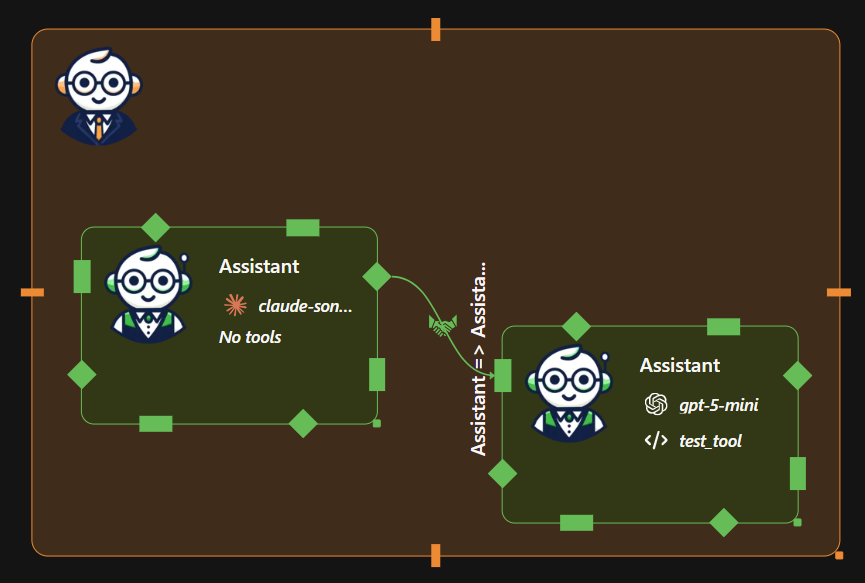
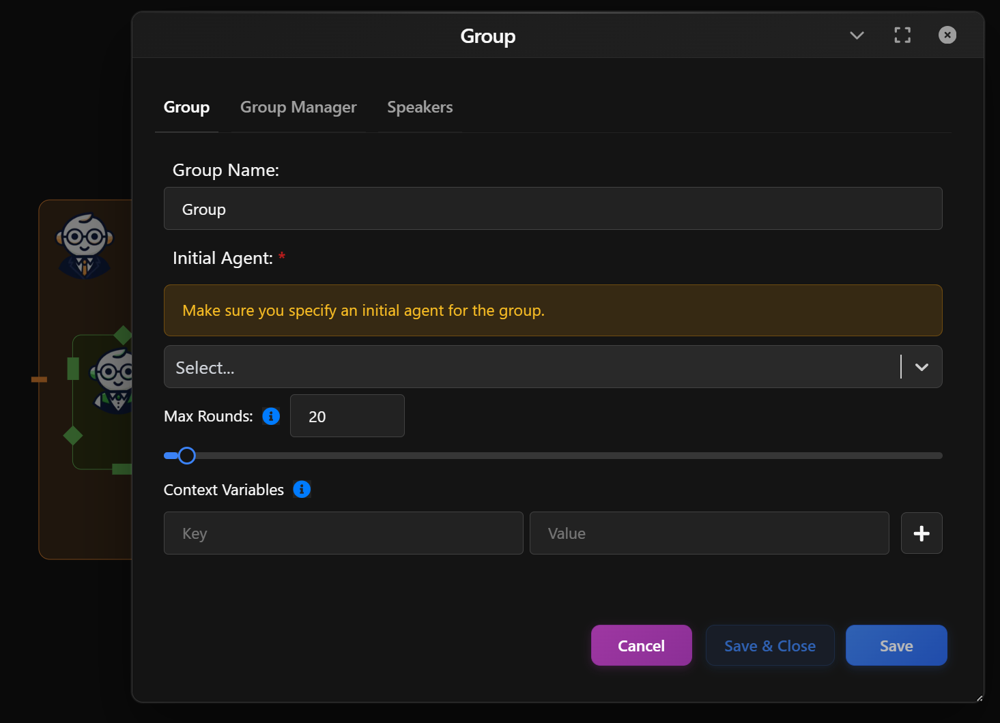
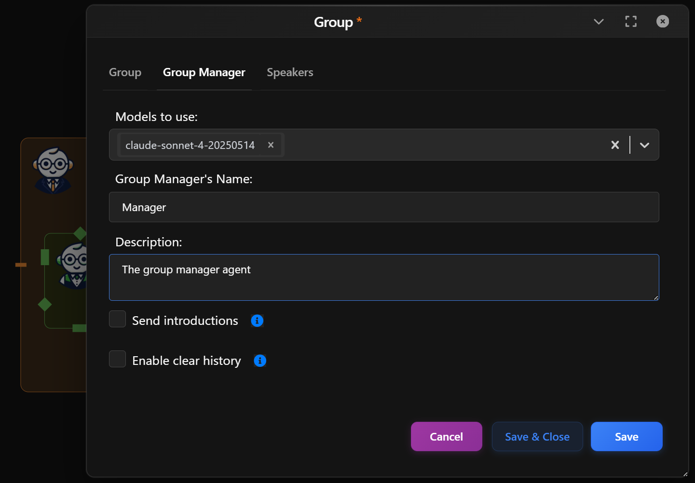
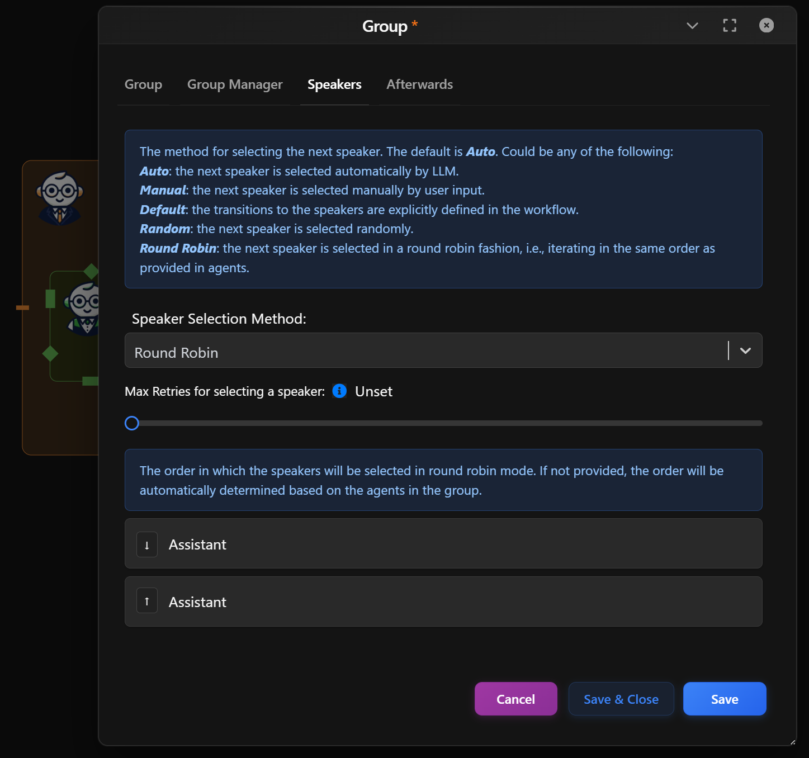
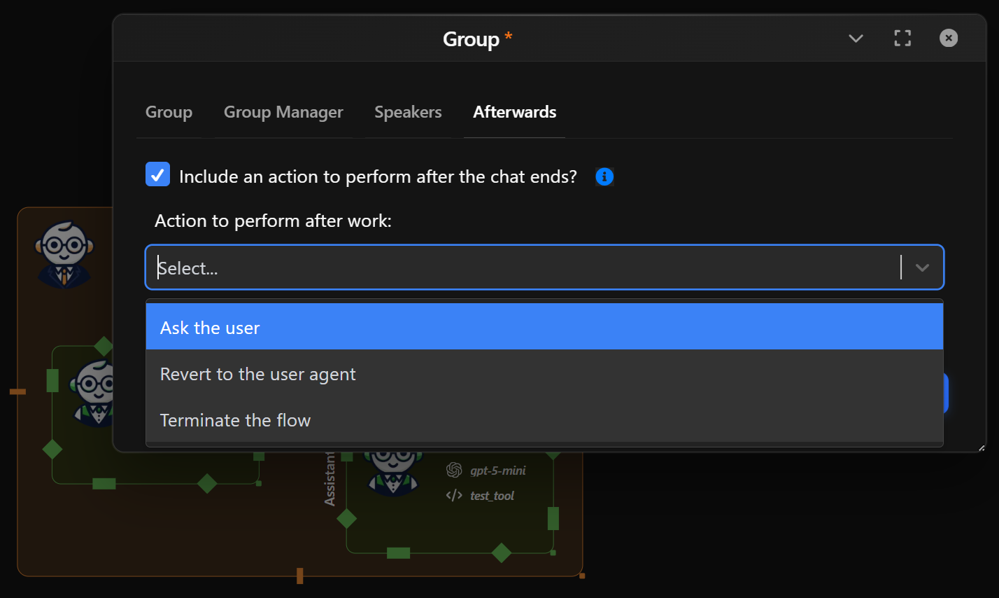

The *Group Manager* Agent orchestrates multi-agent conversations in Waldiez. It controls who speaks, when they speak, how the conversation flows, and what happens when the group finishes.

You can use it to build:  
- Multi-agent debates and brainstorming sessions  
- Role-based collaboration (Planner → Coder → Critic)  
- Tool-driven agent pipelines  
- Autonomous team workflows with structured turn-taking  

--- 

## What the Group Manager Does

The Group Manager acts as the **control plane** for a group chat. It:

- Coordinates turn-taking between agents
- Selects the next speaker using a configurable strategy
- Maintains shared conversation state
- Injects system-level instructions
- Handles termination and post-chat routing

Think of it as the **director** of a multi-agent scene. The agents perform the actions, but the manager controls pacing, rules, and structure.

  

---

## Group Tab - Core Group Settings

Configure the **identity and execution rules** of the group chat, the overall group metadata.

- **Group Name**: A readable label for the group node in your workflow.
- **Initial Agent**: Choose the agent that will start the conversation.  

    This determines:  
    - The opening message  
    - The initial reasoning direction  
    - Which agent sets early context  

- **Max Rounds**: Limits how many conversation turns the group can run before stopping.

    Prevents:  
    - Infinite loops  
    - Runaway agent chatter  
    - Cost overruns  

- **Context Variables**: Define key-value memory pairs to share context between agents.

    Common uses:  
    - Project goals  
    - Dataset paths  
    - API keys or environment flags  
    - Shared mission objectives  

  

---

## Group Manager Tab

Configure the **agent that governs the group**.

- **Models to use**: Select which LLM(s) the Group Manager uses to select speakers, apply policies, and make orchestration decisions.  
- **Group Manager’s Name**: A readable label for the orchestrator (e.g., `Manager`, `Moderator`, `Coordinator`).  
- **Description**: Optional description of the manager's role.  
- **Send Introductions**: Send a round of introductions at the start of the group chat, so agents know who they can speak to (default: False).   

- **Enable Clear History**: Enable the posibility to clear history of messages for agents manually by providing 'clear history' phrase in user prompt.  

  

---

## Speakers Tab

Configure how speakers are selected and ordered during the group conversation. This controls turn-taking logic, flow structure, and who speaks next

### Speaker Selection Method
The default is Auto. Could be any of the following:
- **Auto**: the next speaker is selected automatically by LLM.
- **Manual**: the next speaker is selected manually by user input.
- **Default**: the transitions to the speakers are explicitly defined in the workflow.
- **Random**: the next speaker is selected randomly.
- **Round Robin**: the next speaker is selected in a round robin fashion, i.e., iterating in the same order as provided in agents.

### Max Retries for Selecting a Speaker

The maximum number of times the speaker selection re-query process will run. If, during speaker selection, multiple agent names or no agent names are returned by the LLM as the next agent, it will be queried again up to the maximum number of times until a single agent is returned or it exhausts the maximum attempts. Applies only to 'auto' speaker selection method.  

  

| Method | Best Use Case |
|------|---------------|
| **Auto** | Brainstorming, open-ended discussions, creative ideation, or when the conversation flow should adapt dynamically based on context. |
| **Manual** | Demos, debugging, teaching sessions, or when a human needs full control over turn-taking. |
| **Default** | Deterministic pipelines, structured workflows, and production runs where agent transitions must follow a fixed graph. |
| **Random** | Exploration, stress-testing agents, or introducing stochastic behavior to surface unexpected interactions. |
| **Round Robin** | Debates, reviews, fair turn-taking, or role-based collaboration where each agent must contribute equally in order. |

---
## Afterwards Tab

Configure **what happens after the group chat finishes**.

This allows you to **route control**, **prompt the user**, or **terminate the workflow** once the group completes its task.

### Include an Action After the Chat Ends

Check this to handle conversation continuation when no further options are available. If no agent is selected and no tool calls have output, we will use this property to determine the next action.  

### Action to Perform After Work

Choose what Waldiez should do next:
- **Ask the user**: Prompts the user for instructions or next steps.  
- **Revert to the user agent**: Hands control back to the main user agent node in the workflow.  
- **Terminate the flow**: Ends the workflow immediately with no further actions.  

  

### When to Use Each Option

| Option | Best For |
|------|---------|
| **Ask the user** | Interactive workflows, guided decision-making |
| **Revert to the user agent** | Returning control to a human or main controller |
| **Terminate the flow** | Fully autonomous runs or final pipeline stages |

