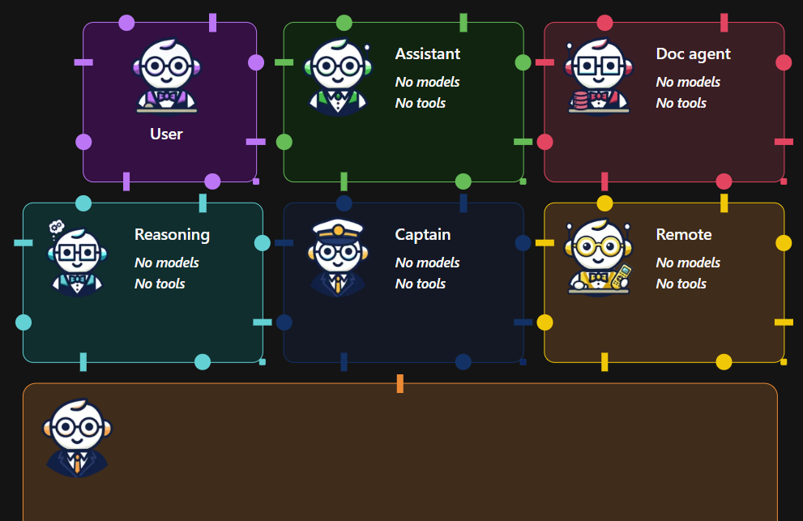
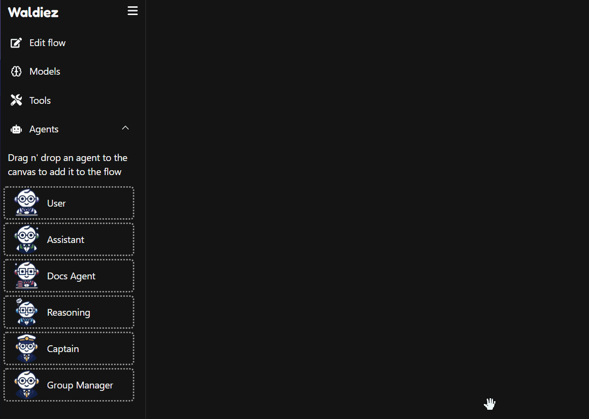
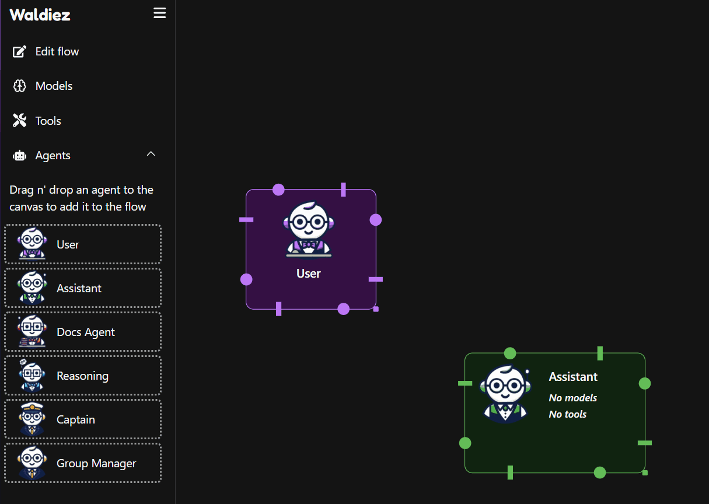
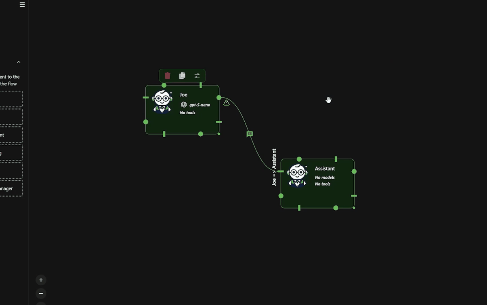

# The Canvas

The **Canvas** is the core workspace in Waldiez. It lets you design, connect, and orchestrate agentic workflows by visually arranging agents and defining how information flows between them.

Think of it as a visual control center for building multi-agent systems — where each node represents a role, capability, or behavior in your workflow.

  

## Adding Agents to the Canvas

On the left sidebar, you'll find options such as "User", "Assistant", and "Group Manager". Drag and drop any of these to the Canvas to start building your workflow.

  

## Connecting Agents - Defining the Flow

Agents communicate by passing messages along connections.

To link two agents:  
1. **Click and drag** from one agent’s output node  
2. Drop the connection **onto another agent's input node**

This defines the direction of communication, control, and execution in your workflow.

  

## Configuring Agent Behavior

Each agent can be customized to control:  
- Its name and role  
- The model(s) it uses    
- Its system message and behavior  
- Linked tools and capabilities   
- Conversation rules and termination conditions  

To edit an agent:  
- **Double-click** it on the Canvas  
- Adjust its settings in the configuration panel  

  

---

## How to Think About the Canvas

You can treat the Canvas as:  
- A **conversation map**  
- A **decision pipeline**  
- A **multi-agent simulation board**  
- Or a **modular AI workflow builder**

Each connection defines **who speaks, who listens, and who decides**, enabling you to scale from a single assistant to complex, orchestrated agent systems.

---

## What to Explore Next

You’ve learned how the Canvas works.  
Now it’s time to understand the agents that live on it.

### 1️⃣ Meet the Agents

Each agent has a distinct role in a workflow.  
We recommend skimming through them first to build intuition.

- 🧍 **[User Agent](../agents/user_agent.md)**  
  Entry point for human input and interaction

- 🤖 **[Assistant Agent](../agents/assistant_agent.md)**  
  Core LLM-driven reasoning and response generation

- 📚 **[Docs Agent](../agents/docs_agent.md)**  
  Documentation-aware agent for grounded answers

- 🧠 **[Reasoning Agent](../agents/reasoning_agent.md)**  
  Structured, multi-step reasoning and analysis

- 🧭 **[Captain Agent](../agents/captain_agent.md)**  
  High-level decision-making and delegation

- 👥 **[Group Manager](../agents/group_manager.md)**  
  Orchestrates multi-agent conversations and flow control

- 🌐 **[Remote Agent](../agents/remote_agent.md)**  
  Connects to agents running in other processes or machines

> 💡 Tip: Start with *[User](../agents/user_agent.md)*, *[Assistant](../agents/assistant_agent.md)*, and *[Manager](../agents/group_manager.md)* if you’re new.

---

### 2️⃣ Learn How Agents Work Together

Once you know the agents, learn how to **connect and orchestrate** them:

- **[Flow](../usage/flow.md)**  
  Define execution order, message routing, and control logic

---

### 3️⃣ Explore Real Workflows

See complete examples you can **reuse or remix**:

- **[Examples](../examples/index.md)**  
  From onboarding flows to RAG, coding, and planning agents

---

### 4️⃣ Build Your First Workflow

Ready to build?

- **[Quick Start](../quickstart/index.md)**  
  Go from empty canvas to working multi-agent system in minutes

