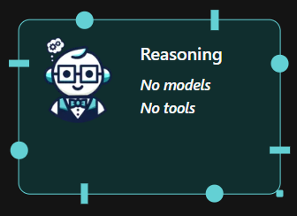
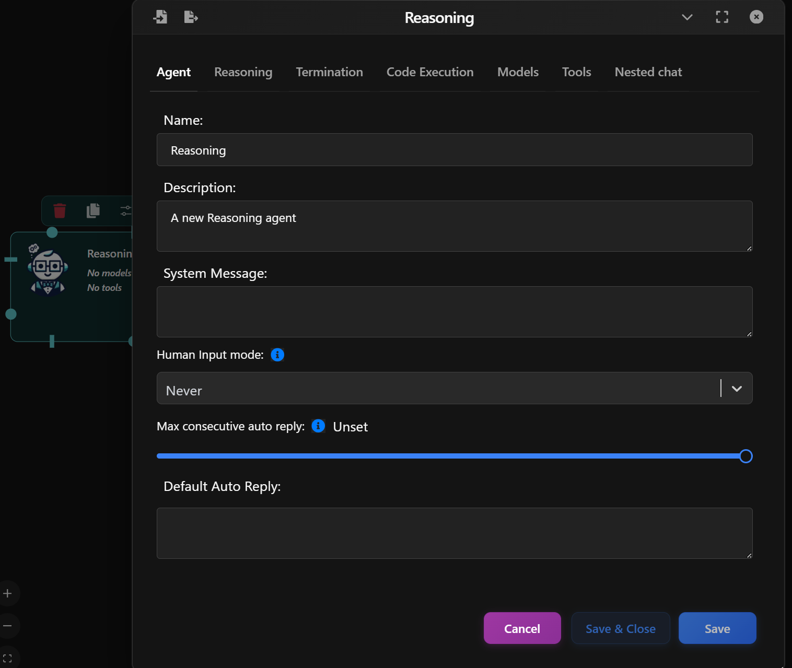
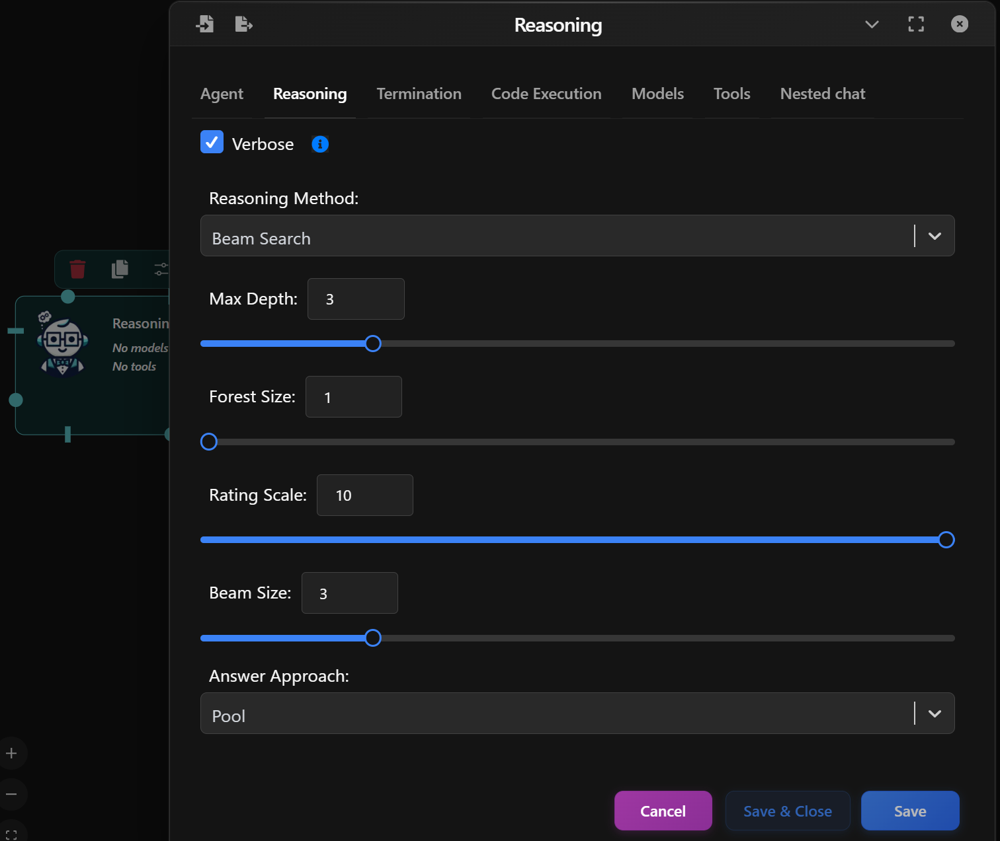
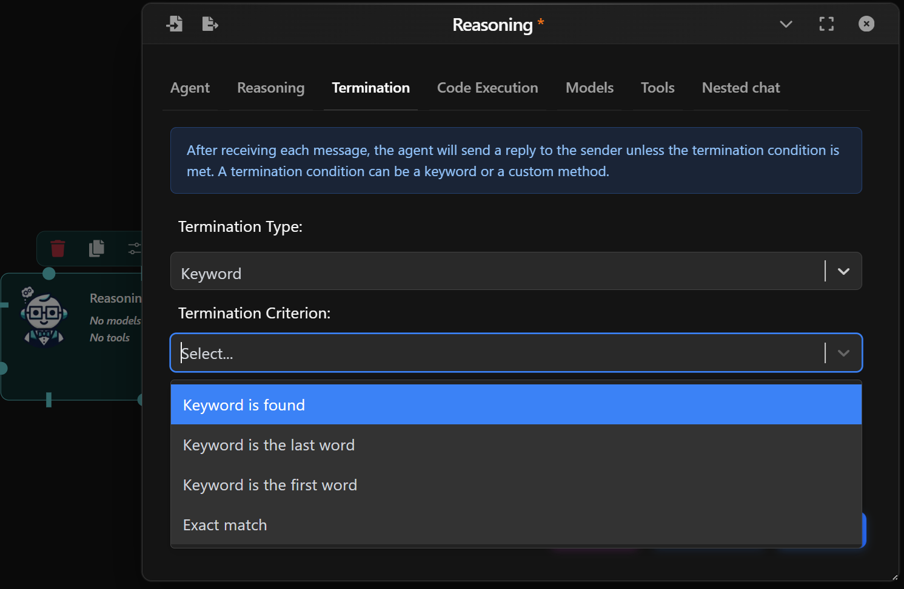
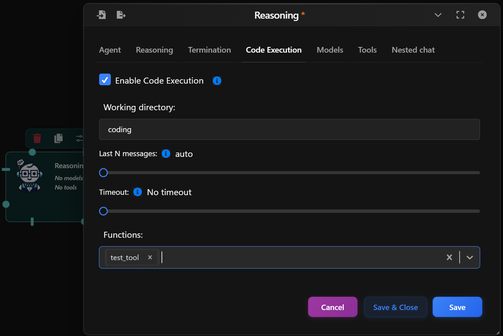
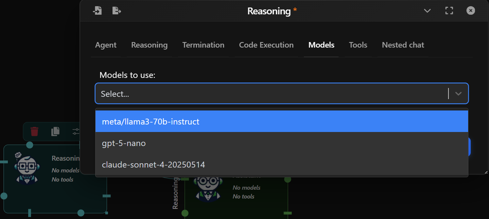
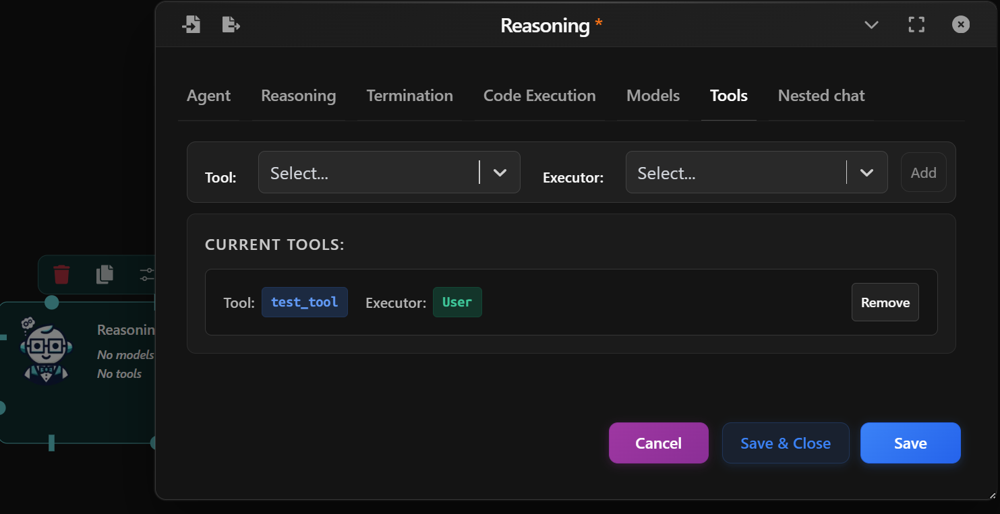

A *Reasoning Agent* is designed for structured multi-step thinking. It doesn’t just generate a single response — it explores different reasoning paths, evaluates them, and selects or pools the best answers.

This agent is best used when decisions require evaluation, ranking, or planning — such as chain-of-thought tasks, multi-step reasoning, or agent voting.

  

## Basic Setup

- **Name & Description**: Customize how the agent is labeled in your flow.
- **System Message**: Define the reasoning agent's behavior or role. 
- **Human Input Mode**: Whether to ask for human inputs every time a message is received. Possible values are:  
  - **Always**: The agent prompts for human input every time a message is received. Under this mode, the conversation stops when the human input is "exit", or when is_termination_msg is True and there is no human input.
  - **Terminate**: The Agent only prompts for human input only when a termination message is received or the number of auto reply reaches the max_consecutive_auto_reply.
  - **Never**: The agent will neever prompt for human input. Under this mode, the conversation stops when the number of auto reply reaches the max_consecutive_auto_reply or when is_termination_msg is True.
- **Max Consecutive auto reply**: The maximum number of consecutive auto replies (i.e., when no code execution or LLM-based reply is generated). Default is None (no limit provided). When set to 0, no auto reply will be generated.
- **Defautl Auto Reply**: Set a Default auto reply.

  

## Reasoning Tab

In the Reasoning tab, you can choose the search strategy and fine-tune how reasoning paths are explored.

- **Verbose**: When enabled, the agent provides insights into its internal decision-making process (great for debugging or teaching).
- **Reasoning Method**: Choose how reasoning paths are explored:  
    - **Beam Search**: Prioritizes best candidates at each step.  
    - **Monte Carlo Tree Search**: Simulates and scores multiple paths randomly.  
    - **Language Agent Tree Search**: A hybrid search using agents.  
    - **Depth First Search**: Explores one branch fully before backtracking.  

  

## Termination Conditions

Control if and when the Agent should stop responding:

- By Keyword: Stop when specific keywords are found (e.g., “stop”, “done”).
- By Method: Use a custom Python function to decide when to stop.

Examples:

- "Keyword is found" — stops when a phrase appears.
- "Exact match" — stops only if the reply is exactly the keyword.

  

## Code Execution Settings

In the Code Execution tab:

- **Enable Code Execution**: Allows the Agent to execute Python snippets (for testing flows or simulating dynamic behavior).
- **Working Directory**: Specify where any temporary code files should be executed.
- **Last N Messages**: Determines how many previous messages should be included as context. __Auto__ will use all available.
- **Timeout**: Optional timeout to prevent long-running code.

This is useful for simulating scenarios where a user performs code-based tasks or replies with dynamically computed results.

  

## Model Configuration

In the Models tab:

- **Model Selection**: Choose a language model (e.g. gpt-4.1) to power your agent.
- You can assign different models to different agents for flexibility.  

For a deeper overview of available models and configuration options, check the [Models Guide](../usage/models.md).

  

## Tools

Reasoning Agents can use tools (e.g., search, calculations, APIs) with executors (other agents like User or Assistant) that run them.

- **Tool**: Choose a defined tool from your system.
- **Executor**: Select which agent will handle the tool execution.
- Add to bind the tool to this assistant.

  

<!--

## Nested Chat

Upon linking the Assistant Agent with another Agent, the Nested Chat tab will appear. For more info, check out Nested Chat (url)

-->