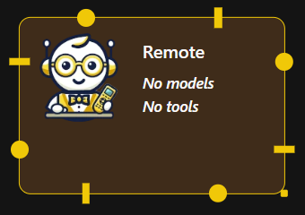
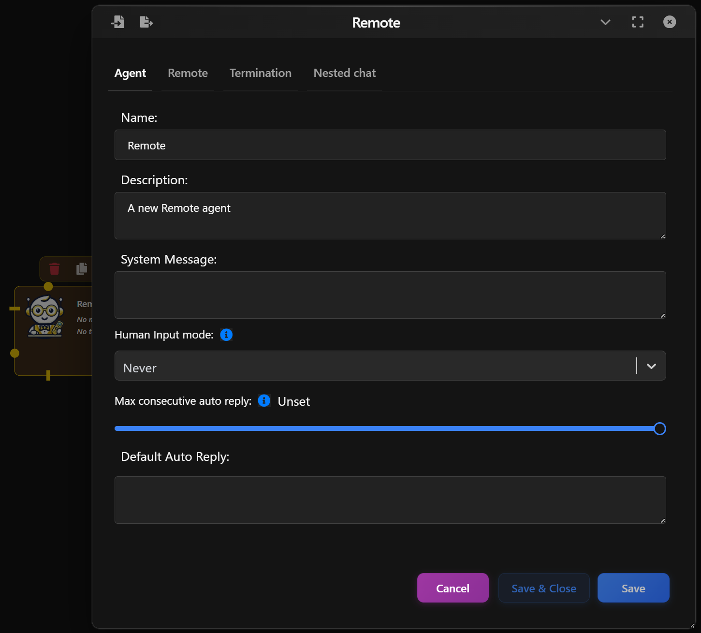
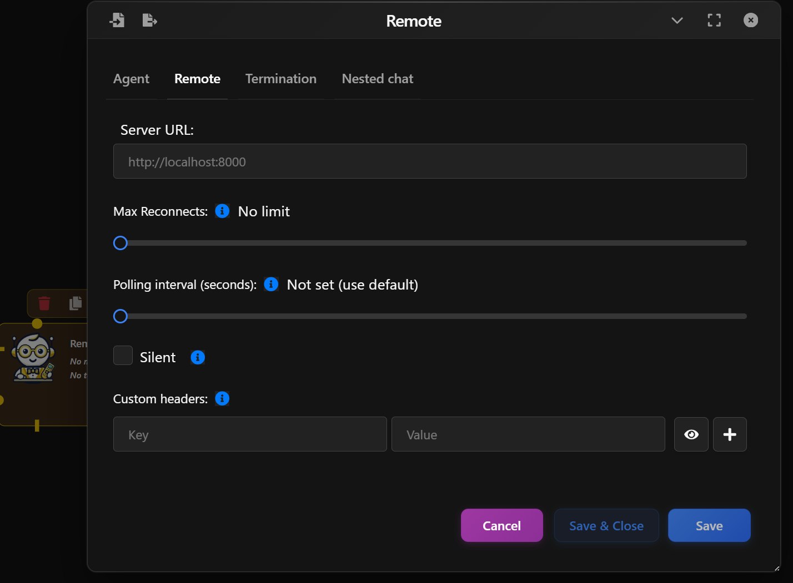
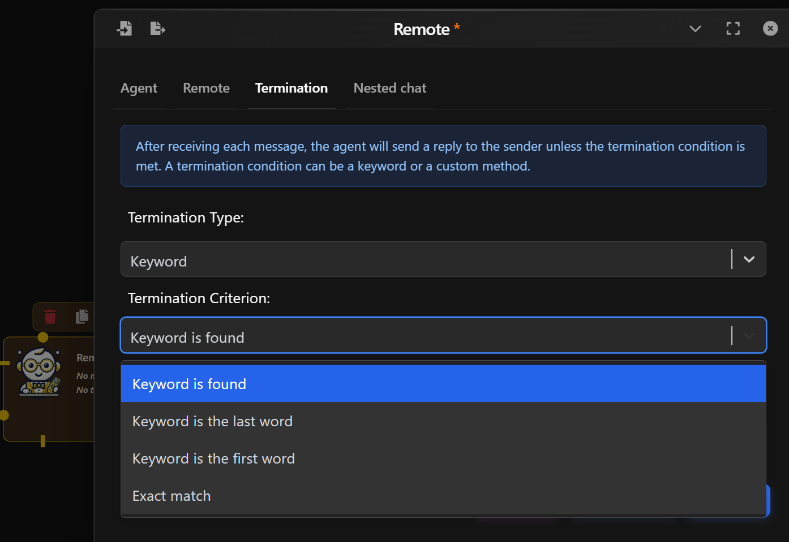

>⚠️ NOTE: This is a feature in an upcoming version of Waldiez.

The *Remote Agent* lets a Waldiez workflow talk to an agent running outside the local environment (i.e. another process, another machine, or a hosted service) using **[A2A (Agent-to-Agent) protocol](https://a2a-protocol.org/)**.

This makes it possible to:  
- Run specialized agents as services (RAG, coding, moderation, tool servers).  
- Offload compute-heavy workloads to external machines or GPUs.  
- Integrate agents ownned by external teams.  

  

## Basic Setup

In the Agent tab, configure the agent's identity and conversational behavior:

- **Name & Description**: Customize how the agent is labeled in your flow.
- **System Message**: Define the agent's behavior or role.
- **Human Input Mode**: Whether to ask for human inputs every time a message is received. Possible values are:  
  - **Always**: The agent prompts for human input every time a message is received. Under this mode, the conversation stops when the human input is "exit", or when is_termination_msg is True and there is no human input.
  - **Terminate**: The Agent only prompts for human input only when a termination message is received or the number of auto reply reaches the max_consecutive_auto_reply.
  - **Never**: The agent will neever prompt for human input. Under this mode, the conversation stops when the number of auto reply reaches the max_consecutive_auto_reply or when is_termination_msg is True.
- **Max Consecutive auto reply**: The maximum number of consecutive auto replies (i.e., when no code execution or LLM-based reply is generated). Default is None (no limit provided). When set to 0, no auto reply will be generated.
- **Defautl Auto Reply**: Set a Default auto reply.

  

## Remote Settings

In the **Remote** tab, configure how Waldiez connects to the external A2A server:

- **Server URL**: This is the address of the remote agent service. 
- **Max Reconnects**: Maximum number of retry attempts if the connection drops before failing.
- **Polling interval**:  Time between polling requests when the remote server __does not support streaming__ 
- **Silent**: Whether to print the message sent to the server.
- **Custom headers**: Additional headers to use when connecting to the server.

  

## Termination Conditions

Control if and when the Agent should stop responding:

- By Keyword: Stop when specific keywords are found (e.g., “stop”, “done”).
- By Method: Use a custom Python function to decide when to stop.

Examples:

- "Keyword is found" — stops when a phrase appears.
- "Exact match" — stops only if the reply is exactly the keyword.

  

