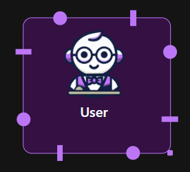

The *User Agent* acts as an intemediary between the real user and the rest of the agent flow. It is responsible for sending user messages into the system and, optionally, simulating replies when human input is not available. 

  

## General Settings

In the User tab:

- **Name**: Set a label to identify this agent (e.g., "User", "Researcher").
- **Max Consecutive Auto Reply**: Define how many automatic replies the agent can send before waiting for human input.
- **Default Auto Reply**: Provide a fallback message that will be used if no input is received (e.g., "Okay", "Continue").

This configuration helps control how the agent behaves in cases where no user is actively participating.

  

## Code Execution Settings

In the Code Execution tab:

- **Enable Code Execution**: Allows the Agent to execute Python snippets (for testing flows or simulating dynamic behavior).
- **Working Directory**: Specify where any temporary code files should be executed.
- **Last N Messages**: Determines how many previous messages should be included as context. __Auto__ will use all available.
- **Timeout**: Optional timeout to prevent long-running code.

This is useful for simulating scenarios where a user performs code-based tasks or replies with dynamically computed results.

  <video
    autoplay
    loop
    muted
    playsinline
    style="
      width: 100%;
      max-width: 580px;
      height: auto;
      border-radius: 10px;
      box-shadow: 0 8px 24px rgba(0,0,0,0.08);
    "
  >
    <source src="../static/videos/user_codeexec.webm" type="video/webm">
  </video>

<!--
## Nested Chat

Upon linking the User Agent with another Agent, the Nested Chat tab will appear. 

-->
