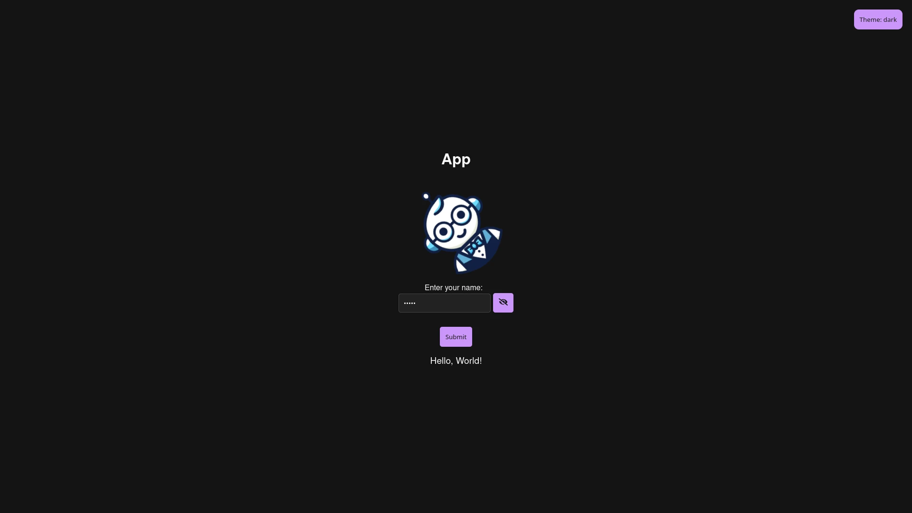

# @my/package

A short description of the package here.



<!-- For links, try using the full url instead of the relative path.
<!--  -->

<!-- ## Features -->

<!-- ## Installation

```bash
npm|yarn|pnpm|bun install @my/package
``` -->

<!-- ## Contributing -->

<!-- If the CONTRIBUTING.md file has a public url,
prefer using he url instead of the file path.
Why you ask? For example, the link in the PyPI page might not work.
-->

Please read [CONTRIBUTING.md](CONTRIBUTING.md) for details on our code of conduct, and the process for submitting pull requests.

> [!IMPORTANT]
>
> **Required files**
>
> - `package.json`: The package.json file must be present in the root of the repository. It must contain a `scripts` object and should also define the `packageManager` field (e.g. `"packageManager": "bun@1.4.2"`, or `"packageManager": "yarn@4.5.3"`)
>
> **Required scripts**
>
> - `format`: The `format` script must be present in the `package.json` file.
> - `lint`: The `lint` script must be present in the `package.json` file.
> - `clean`: The `clean` script must be present in the `package.json` file.
> - `test`: The `test` script must be present in the `package.json` file. It must generate a `coverage/lcov.info` file with the test coverage report.
> - `build`: The `build` script must be present in the `package.json` file. It must generate the distributable files in the `dist` directory.
>
> **Optional scripts**
>
> - `archive`: The `archive` script is optional. If present, it must generate a tarball of the package in the `out` directory.
> - `publish`: The `publish` script is optional. If present, it must publish the package to the registry.
> - `docs`: The `docs` script is optional. If present, it must generate the documentation in the `site` directory.

## Init

```shell
# if not already, install bun:
# curl -fsSL https://bun.sh/install | bash
# or:
# powershell -c "irm bun.sh/install.ps1 | iex"
bun install
bun all
# Ths should produce:
# - A `dist` directory with the distributable files (index.html, assets/ ...)
# - A `site` directory with the documentation (site/index.html, site/assets/ ...)
# - An `out` directory with the tarball of the package (out/my-package-1.0.0.tgz)
# - A `coverage` directory with the test coverage report (coverage/lcov.info, ...)
```

## License

<!-- If the LICENSE file has a public url,
prefer using he url instead of the file path.
Why you ask? For example, the link in the PyPI page might not work.
-->

This project is licensed under the MIT License - see the [LICENSE](LICENSE) file for details.
